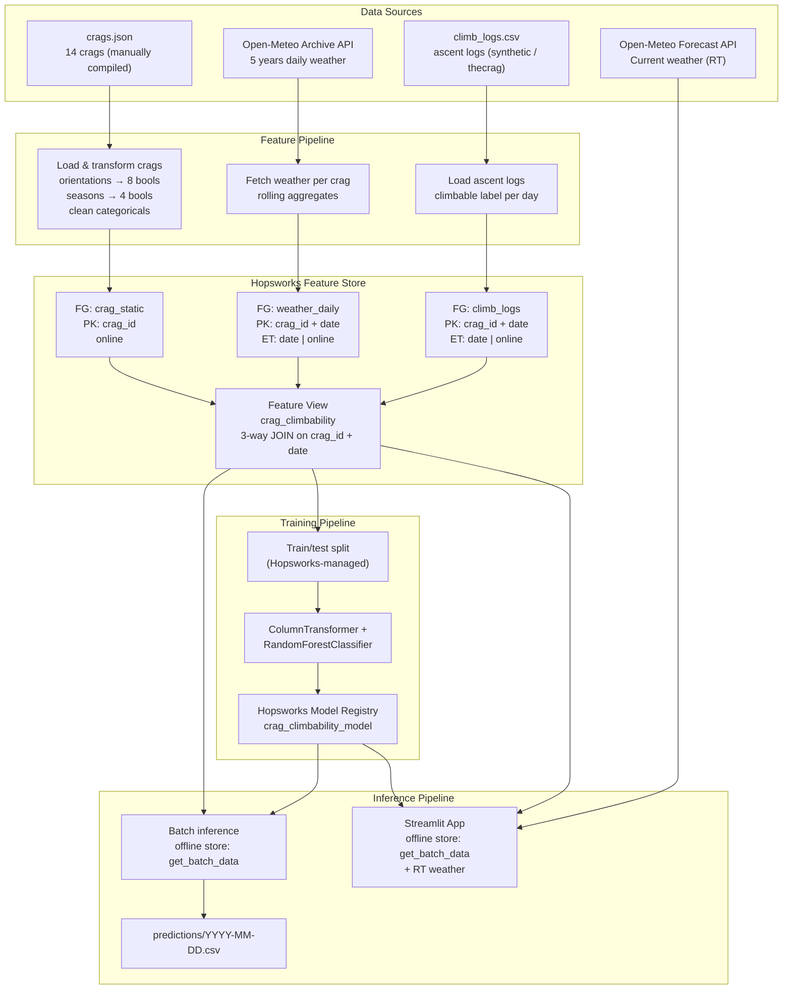
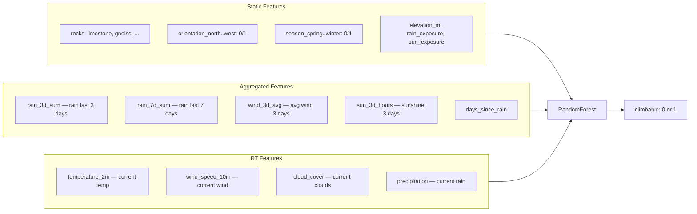

# Crag Climbability Prediction — MLOps Project

Predict whether a climbing crag near Basel is **climbable today** based on static crag attributes and weather conditions, using an end-to-end MLOps pipeline built on **Hopsworks Feature Store**.

## Architecture



## Data Flow



## Dataset

**Source:** 14 climbing crags within 100 km of Basel, manually compiled from multiple sources: [oblyk.org](https://oblyk.org), [thecrag.com](https://www.thecrag.com) and [ukclimbing.com](https://www.ukclimbing.com).

| Column | Description |
|--------|-------------|
| `crag_id` | Unique crag identifier |
| `name` | Crag name (e.g. "Gempen (Schartenfluh)") |
| `latitude`, `longitude` | Coordinates |
| `elevation_m` | Elevation in meters |
| `rocks` | Rock type (limestone, gneiss, granite, sandstone, volcanic) |
| `rain_exposure` | exposed / protected |
| `sun_exposure` | sunny_all_day / sunny_morning / sunny_afternoon / shady |
| `orientations` | Compass directions (north, south, east, west, ...) |
| `seasons` | Climbing seasons (spring, summer, autumn, winter) |

**Weather data:** Daily historical weather from the [Open-Meteo Archive API](https://open-meteo.com/) (last 5 years), plus current conditions from the Forecast API.

**Crag data format:** `data/crags.json` — crag metadata (14 crags) used by pipelines (JSON format).

**Climb logs:** `data/climb_logs.csv` — `(crag_id, date, ascents_logged, climbable, source)`. This file contains the merged climb logs: real ascent records scraped from [thecrag.com](https://www.thecrag.com) (`source = thecrag`) plus synthetic rows (`source = synthetic`). Current counts: **25,858 rows** total (1,204 real + 24,654 synthetic). The `source` column indicates the origin of each row.

### How the synthetic data was generated

Synthetic climb logs are produced by `src/tools/generate_synthetic_climb_logs.py` using a **calendar-based probabilistic model** that is intentionally independent of weather features:

1. For each crag × date combination over the last 5 years, a Bernoulli draw determines whether at least one ascent is logged (`climbable = 1`).
2. The probability depends on:
   - **Season membership** — whether the month falls within the crag's declared climbing seasons (`BASE_P_IN_SEASON = 0.95`, `BASE_P_OFF_SEASON = 0.92`).
   - **Day of week** — Fridays through Sundays receive a `WEEKEND_MULTIPLIER = 2.0` boost (capped at 1.0).
3. If `climbable = 1`, the number of ascents is drawn from a Poisson distribution (`λ = 1.5` weekday, `λ = 4.0` weekend).
4. The parameters were calibrated so that on days where real thecrag data records at least one ascent, the synthetic model agrees ≈ 95% of the time (measured recall).

Because the label uses **no weather inputs**, the ML model's task is to discover the genuine correlation between weather conditions and climbing activity.

### Data files

| File | Rows | Description |
|------|------|-------------|
| `data/crags.json` | 14 entries | Crag metadata used by pipelines |
| `data/climb_logs.csv` | 25,858 | Merged ascent logs (1,204 `thecrag` + 24,654 `synthetic`) |

## Features

### Static Features (from `crag_static` Feature Group)

| Feature | Type | Description |
|---------|------|-------------|
| `rocks` | categorical | Rock type |
| `rain_exposure` | categorical | How exposed to rain |
| `sun_exposure` | categorical | Sun exposure pattern |
| `elevation_m` | numeric | Crag elevation |
| `orientation_*` | binary (×8) | Compass orientation flags |
| `season_*` | binary (×4) | Climbing season flags |
| `num_climbing_types` | numeric | Number of climbing disciplines |

### Aggregated Features (from `weather_daily` Feature Group) — BATCH

These are computed using **rolling windows** over historical daily weather data:

| Feature | Window | Description |
|---------|--------|-------------|
| `rain_3d_sum` | 3 days | Cumulative precipitation |
| `rain_7d_sum` | 7 days | Cumulative precipitation |
| `wind_3d_avg` | 3 days | Average of daily max wind speed |
| `sun_3d_hours` | 3 days | Cumulative sunshine hours |
| `days_since_rain` | variable | Days since last rain > 1mm |

### Real-Time (RT) Features — fetched at inference time

| Feature | Description |
|---------|-------------|
| `temperature_2m` | Current temperature (°C) |
| `wind_speed_10m` | Current wind speed (km/h) |
| `cloud_cover` | Current cloud cover (%) |
| `precipitation` | Current precipitation (mm) |

### Label (from `climb_logs` Feature Group)

| Feature | Type | Description |
|---------|------|-------------|
| `climbable` | binary | 1 = at least one ascent logged that day, 0 = no ascents |

## Model

- **Algorithm:** `RandomForestClassifier` (scikit-learn) with 100 estimators
- **Preprocessing:** `ColumnTransformer` — `OneHotEncoder` for categorical features, `StandardScaler` for numeric
- **Train/test split:** Hopsworks-managed `fv.train_test_split(test_size=0.2)`
- **Model performance is NOT the focus** of this project (as per assignment instructions)

### Champion / Challenger Workflow

The project uses a **champion/challenger** pattern via Hopsworks Model Registry tags:

| Stage | Tag | Description |
|-------|-----|-------------|
| **Champion** | `production` | Currently deployed model — used by inference pipeline & Streamlit app |
| **Challenger** | `staging` | Newly trained model awaiting review |
| **Archived** | `archived` | Previously promoted models (demoted when a new champion is set) |

**Workflow:**

```
┌─────────────────┐     train      ┌──────────────────┐    promote     ┌──────────────────┐
│  Data Scientist │ ──────────────▶ │ staging (v N+1)  │ ─────────────▶ │ production (v N+1)│
│  edits config   │                 │ (challenger)     │                │ (new champion)    │
└─────────────────┘                 └──────────────────┘                └──────────────────┘
                                                                          old champion → archived
```

1. **Train** — Run `python -m src.pipelines.training_pipeline`. Each run auto-increments the model version and tags it as `staging`.
2. **Compare** — Open the Streamlit app → "Model Performance" tab to see metrics side-by-side.
3. **Promote** — Run `python -m src.pipelines.promote_model` (or `--version N` for a specific version). This moves the current champion to `archived` and the new model to `production`.
4. **Inference** — The inference pipeline and Streamlit app automatically load the `production`-tagged model.

## Setup & Run

### Prerequisites

- [Docker](https://docs.docker.com/get-docker/)
- A free [Hopsworks](https://app.hopsworks.ai/) account (free tier is sufficient)

### 1. Clone and configure

```bash
git clone <repo-url>
cd MLOps-project

cp .env.example .env
# Edit .env: fill in HOPSWORKS_API_KEY and HOPSWORKS_PROJECT
```

Get your API key: **[app.hopsworks.ai](https://app.hopsworks.ai/)** → Account Settings → API Keys

### 2. Build the Docker image

```bash
docker build -t crag-mlops .
```

### 3. Run the pipelines (in order)

```bash
# 1. Feature pipeline — loads crags, fetches 5 years of weather, uploads to Hopsworks
#    ⏱ ~5-10 minutes (14 crags × 5 years of daily weather)
docker run --env-file .env crag-mlops python -m src.pipelines.feature_pipeline

# 2. Training pipeline — creates Feature View, trains model, registers in Model Registry
docker run --env-file .env crag-mlops python -m src.pipelines.training_pipeline

# 3. Inference pipeline — predicts climbability for all crags, writes predictions/ CSV
docker run --env-file .env crag-mlops python -m src.pipelines.inference_pipeline
```

### 4. Run the Streamlit app

```bash
docker run --env-file .env -p 8501:8501 crag-mlops \
    streamlit run src/app/streamlit_app.py --server.port 8501 --server.address 0.0.0.0
```

Open [http://localhost:8501](http://localhost:8501) in your browser.

### Running without Docker (local development)

Requires Python 3.11 and [uv](https://docs.astral.sh/uv/).

```bash
uv venv --python 3.11
# Windows:
.venv\Scripts\activate
# macOS/Linux:
source .venv/bin/activate

uv pip install -r requirements.txt
```

> **Windows note:** If `twofish` (a Hopsworks transitive dependency) fails to build,
> install hopsworks without its dependencies first:
> ```bash
> uv pip install hopsworks --no-deps
> uv pip install -r requirements.txt
> ```

Then run any pipeline or the app directly:

```bash
python -m src.pipelines.feature_pipeline
python -m src.pipelines.training_pipeline
python -m src.pipelines.inference_pipeline
streamlit run src/app/streamlit_app.py
```

## Online vs. Offline Feature Store

The project uses the **offline store** for all feature retrieval. This avoids requiring the SQL client (`sqlalchemy`) on the inference host, which is not needed for batch use cases.

| Use case | Store type | API | Used in |
|----------|-----------|-----|---------|
| Daily batch predictions | **Offline** | `fv.get_batch_data()` | Inference pipeline |
| Interactive single-crag prediction | **Offline** | `fv.get_batch_data()` → latest row | Streamlit app |
| All-crags prediction map | **Offline** | `fv.get_batch_data()` → latest per crag | Streamlit app |

Both Feature Groups are still created with `online_enabled=True` — the online store is populated and available if a real-time lookup path is added later.

## Limitations & Reflection

- **Small dataset:** Only 14 crags near Basel — not enough for a generalizable model, but sufficient to demonstrate the MLOps pipeline.
- **Mostly synthetic labels:** Only 1,204 of 25,858 rows are real ascent records from thecrag.com; the remaining 24,654 rows come from a calendar-based probabilistic generator. The synthetic model is independent of weather features but noisier than true observations.
- **Open-Meteo archive lag:** The historical weather API has a ~5-day delay. We bridge this with the forecast API's `past_days` parameter.
- **No real ground truth feedback loop:** In a production system, user-reported climbing conditions (from apps like thecrag or oblyk) would continuously improve label quality.
- **Weather-only features:** The model doesn't consider rock moisture sensors, route difficulty, or webcam data.

## Possible Extensions

The assignment mentions these "Ausbaustufen" (enhancements):

- [x] **Multiple Feature Groups + join** — `crag_static` ⋕ `weather_daily` ⋕ `climb_logs`
- [x] **Hopsworks-managed train/test splits** — `fv.train_test_split()`
- [x] **Web application for inference** — Streamlit app with model performance dashboard
- [x] **Ground truth label from separate source** — `climb_logs` FG (real thecrag data + synthetic)
- [x] **Containerization (Docker)** — `Dockerfile` + `src/pipelines/` scripts
- [x] **Champion/Challenger model management** — auto-versioning + promote workflow
- [ ] Data validation with Great Expectations
- [ ] Hopsworks Transformation Functions for preprocessing
- [ ] Spine Groups for point-in-time correct joins
- [ ] Feed RT features and ground truth back into the Feature Store
- [ ] Deploy the model in Hopsworks (KServe)
